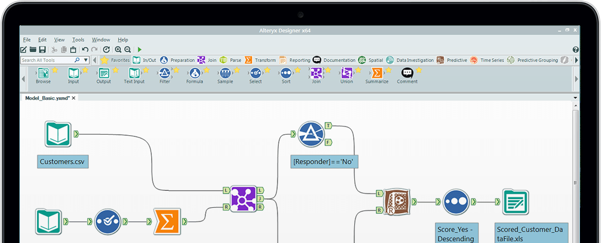

---

## Tale of Two Plots

---

```{r echo = F, fig.width = 12}
library(ggplot2)
males = subset(as.data.frame(HairEyeColor), Sex == "Male")
ggplot(males, aes(x = Hair, y = Freq, fill = Eye)) +
 geom_bar(position = 'dodge', stat = 'identity') +
 scale_fill_manual(
   values = c('brown', 'blue', '#594c26', 'green')
 ) +
 theme(legend.position = 'none')
```


---

```{r echo = F, warning = F, message = F}
library(dplyr)
library(rCharts2)
hair_eye = as.data.frame(HairEyeColor)
n2 <- nvd3(data = subset(hair_eye, Sex == "Female"),
  Freq ~ Hair, 
  type = 'multiBarChart',
  group = 'Eye',
  height = 350
) %>%
  chart(color = c('brown', 'blue', '#594c26', 'green'))
htmlwidgets::saveWidget(n2, 'chart2.html')
```


<iframe src='chart2.html' width='100%' height='600px'></iframe>

---

```{r eval = F}
ggplot(males, aes(x = Hair, y = Freq, fill = Eye)) +
 geom_bar(position = 'dodge', stat = 'identity') +
 scale_fill_manual(
   values = c('brown', 'blue', '#594c26', 'green')
 ) +
 theme(legend.position = 'none')
```

--- #htmlcode

```html

<!DOCTYPE html>
<html>
<head>
<meta charset="utf-8"/>
<script src="lib/htmlwidgets-0.3.2/htmlwidgets.js"></script>
<script src="lib/angular-1.2.20/angular.min.js"></script>
<script src="lib/d3-3.4.11/d3.min.js"></script>
<link href="lib/nvd3-1.1.15/nv.d3.css" rel="stylesheet" />
<script src="lib/nvd3-1.1.15/nv.d3.min.js"></script>
<script src="lib/angular-nvd3-0.0.9/angular-nvd3.min.js"></script>
<link href="lib/ghbuttons-1.0.0/gh-buttons.css" rel="stylesheet" />
<link href="lib/ghbuttons-1.0.0/better-select.css" rel="stylesheet" />
<script src="lib/datgui-0.5.0/dat.gui.min.js"></script>
<script src="lib/nvd3-binding-0.1/nvd3.js"></script>

</head>
<body>
<div id="htmlwidget_container">
  <div id="htmlwidget-1329" class="nvd3" width="100%" height="400">
    <div ng-controller="myCtrl1329">
      <div>
        <form id="controls-for-htmlwidget-1329"></form>
      </div>
      <nvd3 options="options" data="data" api="api"></nvd3>
    </div>
  </div>
</div>
<script type="application/json" data-for="htmlwidget-1329">{ "x": {
 "y": "Freq",
"type": "multiBarChart",
"group": "Eye",
"x": "Hair",
"data": [
 {
 "Hair": "Black",
"Eye": "Brown",
"Sex": "Female",
"Freq":                36 
},
{
 "Hair": "Brown",
"Eye": "Brown",
"Sex": "Female",
"Freq":                66 
},
{
 "Hair": "Red",
"Eye": "Brown",
"Sex": "Female",
"Freq":                16 
},
{
 "Hair": "Blond",
"Eye": "Brown",
"Sex": "Female",
"Freq":                 4 
},
{
 "Hair": "Black",
"Eye": "Blue",
"Sex": "Female",
"Freq":                 9 
},
{
 "Hair": "Brown",
"Eye": "Blue",
"Sex": "Female",
"Freq":                34 
},
{
 "Hair": "Red",
"Eye": "Blue",
"Sex": "Female",
"Freq":                 7 
},
{
 "Hair": "Blond",
"Eye": "Blue",
"Sex": "Female",
"Freq":                64 
},
{
 "Hair": "Black",
"Eye": "Hazel",
"Sex": "Female",
"Freq":                 5 
},
{
 "Hair": "Brown",
"Eye": "Hazel",
"Sex": "Female",
"Freq":                29 
},
{
 "Hair": "Red",
"Eye": "Hazel",
"Sex": "Female",
"Freq":                 7 
},
{
 "Hair": "Blond",
"Eye": "Hazel",
"Sex": "Female",
"Freq":                 5 
},
{
 "Hair": "Black",
"Eye": "Green",
"Sex": "Female",
"Freq":                 2 
},
{
 "Hair": "Brown",
"Eye": "Green",
"Sex": "Female",
"Freq":                14 
},
{
 "Hair": "Red",
"Eye": "Green",
"Sex": "Female",
"Freq":                 7 
},
{
 "Hair": "Blond",
"Eye": "Green",
"Sex": "Female",
"Freq":                 8 
} 
],
"options": {
 "chart": {
 "type": "multiBarChart",
"width": null,
"height":               400,
"xAxis": [],
"yAxis": [],
"color": [ "brown", "blue", "#594c26", "green" ] 
},
"title": {
 "enable": true,
"html": "<h3 style='font-family: sanserif;'>Plot of Freq vs Hair</h3>" 
},
"subtitle": {
 "enable": true,
"text": "" 
},
"caption": {
 "enable": true,
"text": "" 
} 
},
"height":               400 
},"evals": [  ] }</script>
<script type="application/htmlwidget-sizing" data-for="htmlwidget-1329">{ "viewer": {
 "width": "100%",
"height":               400,
"padding":                15,
"fill": false 
},"browser": {
 "width": "100%",
"height":               400,
"padding":                40,
"fill": false 
} }</script>
</body>
</html>
```

--- 


</img>

---

<iframe src="http://rcharts.io" height=600 width=100%></iframe>

---

```r
library(rCharts2)
nvd3(females,
  Freq ~ Hair, 
  type = 'multiBarChart',
  group = 'Eye'
) %>%
  chart(color = c('brown', 'blue', '#594c26', 'green'))
```

---

<iframe src='chart2.html' width='100%' height='600px'></iframe>

---


```{r echo = -c(1:2), message = F}
OSM_URL <- "http://{s}.tile.openstreetmap.org/{z}/{x}/{y}.png"
MAPBOX_URL <- "http://a.tiles.mapbox.com/v3/examples.map-zr0njcqy/{z}/{x}/{y}.png"
library(rMaps2)
d1 <- crosslet(
  x = "country", 
  y = c("web_index", "universal_access", 
    "impact_empowerment", "freedom_openness"
  ),
  data = web_index,
  map = map_world(leaflet = list(url = OSM_URL))
)
```

---

```{r echo = F}
htmlwidgets::saveWidget(d1, 'chart3.html', selfcontained = F, libdir = 'libraries')
```

<iframe src='chart3.html' width='100%' height='600px'></iframe>


--- {bg: "http://www.saepio.com/images/how-it-works-top.jpg", id: howitworks}

## How does it Work?

---

<iframe src="http://jsfiddle.net/ramnathv/fffhc9ej/6/embedded/result/presentation/" height=600 width=100%></iframe>

---

<iframe src="http://jsfiddle.net/ramnathv/fffhc9ej/6/embedded/resources/presentation/" height=600 width=100%></iframe>

---

<iframe src="http://jsfiddle.net/ramnathv/fffhc9ej/6/embedded/html/presentation/" height=600 width=100%></iframe>

---

<iframe src="http://jsfiddle.net/ramnathv/fffhc9ej/6/embedded/js/presentation/" height=600 width=100%></iframe>

--- {bg: lightgoldenrodyellow, id: htmlwidgets}

## [htmlwidgets](http://htmlwidgets.org)

<small>with RStudio and Kenton Russell</small>

--- #yamldep

## Resources

```yaml
dependencies:
  - name: jquery
    version: 2.1.1
    src: "htmlwidgets/lib/jquery/dist/"
    script: "jquery.min.js"
  - name: raphael
    version: 2.1.1
    src: "htmlwidgets/lib/raphael"
    script: "raphael-min.js"
  - name: morris.js
    version: 0.5.0
    src: "htmlwidgets/lib/morris"
    script: morris.min.js
    style: morris.css
```

---

## Javascript

```js
HTMLWidgets.widget({
  type: "output",
  name: "morris",
  renderValue: function(el, x){
    x.element = el.id
    x.data = HTMLWidgets.dataframeToD3(x.data)
    new Morris[x.type](x)
  }
})
```


---

## DEMOS

1. [Communicating Widgets](http://bl.ocks.org/ramnathv/raw/51f61a43f81910b868a5/)
2. [D3 Shot Chart](http://bl.ocks.org/ramnathv/raw/a114d8c9cd6c4a4e1d9b/)

--- {bg: "http://cdn.overclock.net/5/5d/5d68138d_Multiple-Monitors-8.jpeg", id: multi}

## Multiple Contexts

--- 

</img>

---

</img>

---

</img>

--- {bg: "http://img.edilportale.com/products/prodotti-83213-rel32f790d91bac4159897aa66ea535d4fa.jpg", id: 'composable'}

## Composable

---

## More Demos


---

## Questions

---

## Thank You

<style>
#composable h2 {
 position: absolute;
 bottom: -500px;
 right: 5px;
}
.reveal pre{box-shadow: none;}
.reveal pre code{
  font-family: Consolas;
  font-size: 30px; 
  line-height: 36px;
  background: none;
  color: black;
  opacity: 0.8;
}
.reveal section img{
  border: none;
  box-shadow: none;
}
#htmlcode pre code {
  font-size: 10px;
  line-height: 12px;
}

#yamldep pre code {
  font-size: 24px;
  line-height: 28px;
}
#howitworks h2 {
  position: absolute;
  bottom: 300px;
  right: -50px;
}
#multi h2 {
  color: white;
}
</style>


